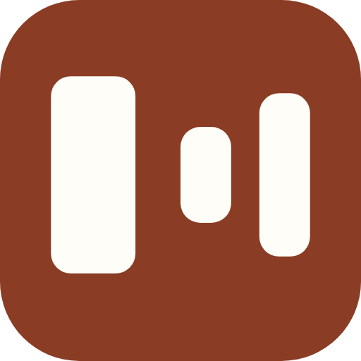
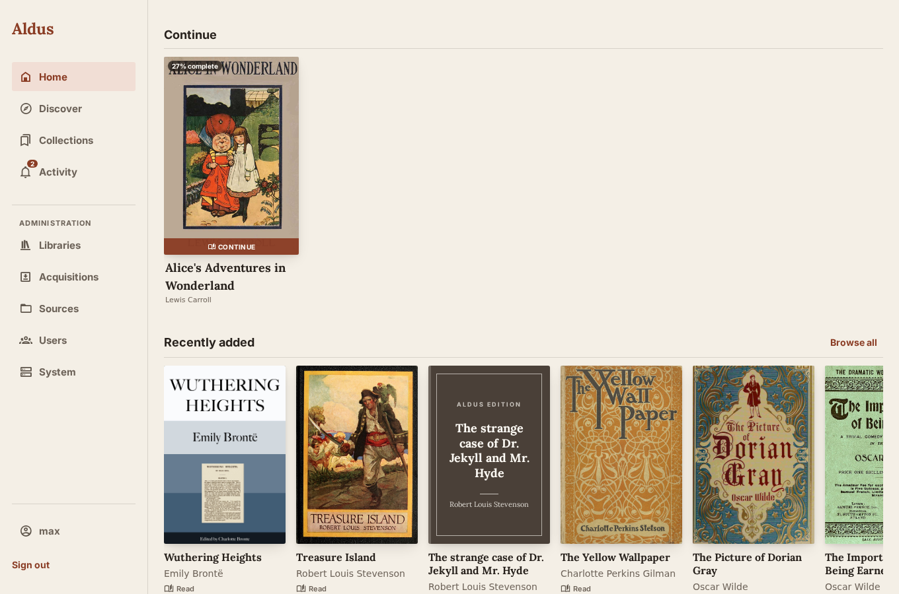
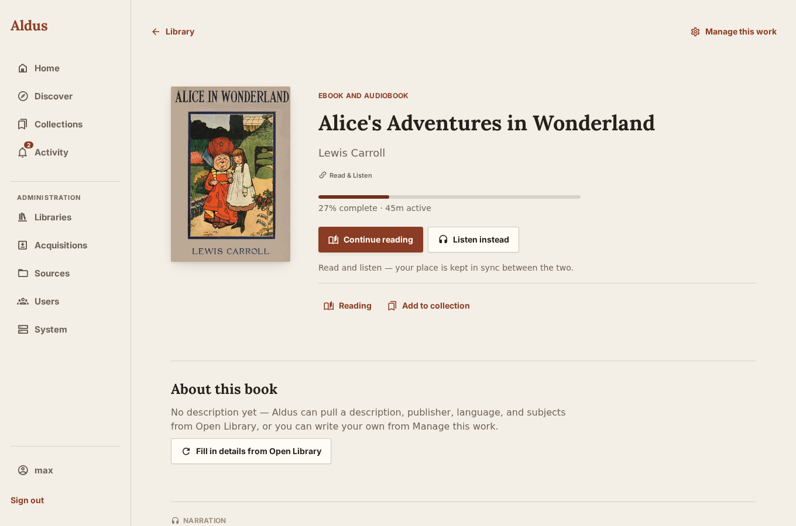
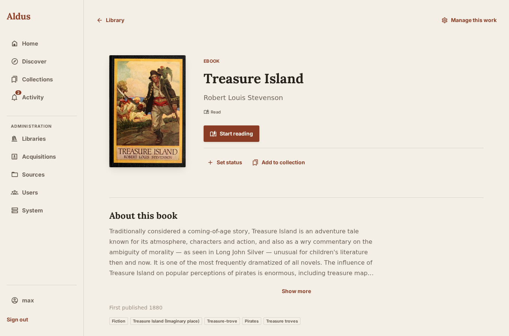
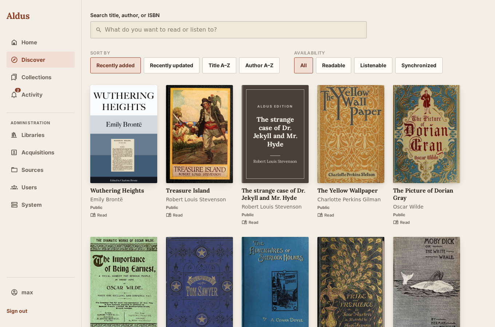
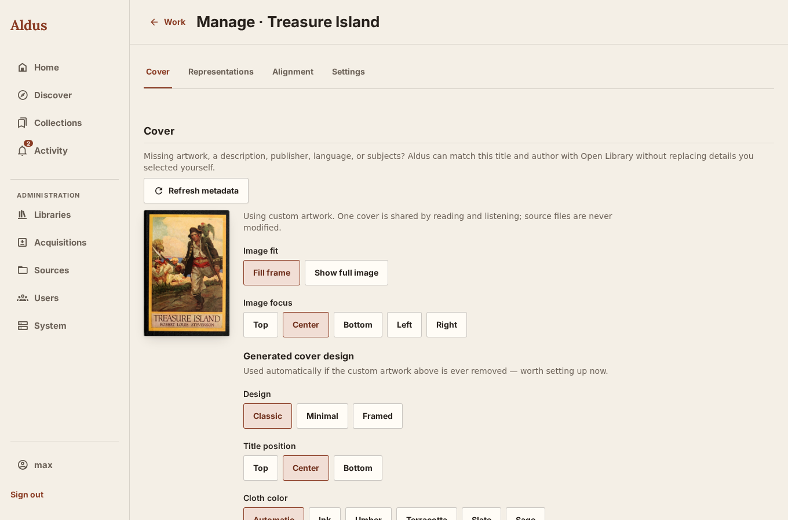
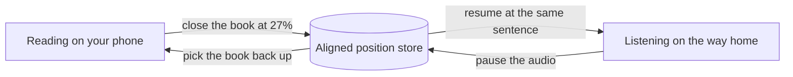
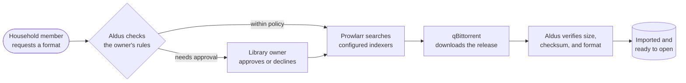
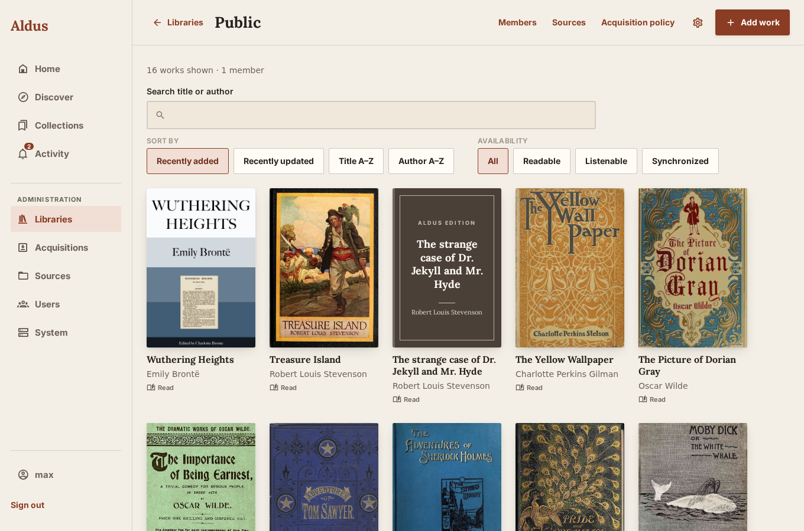
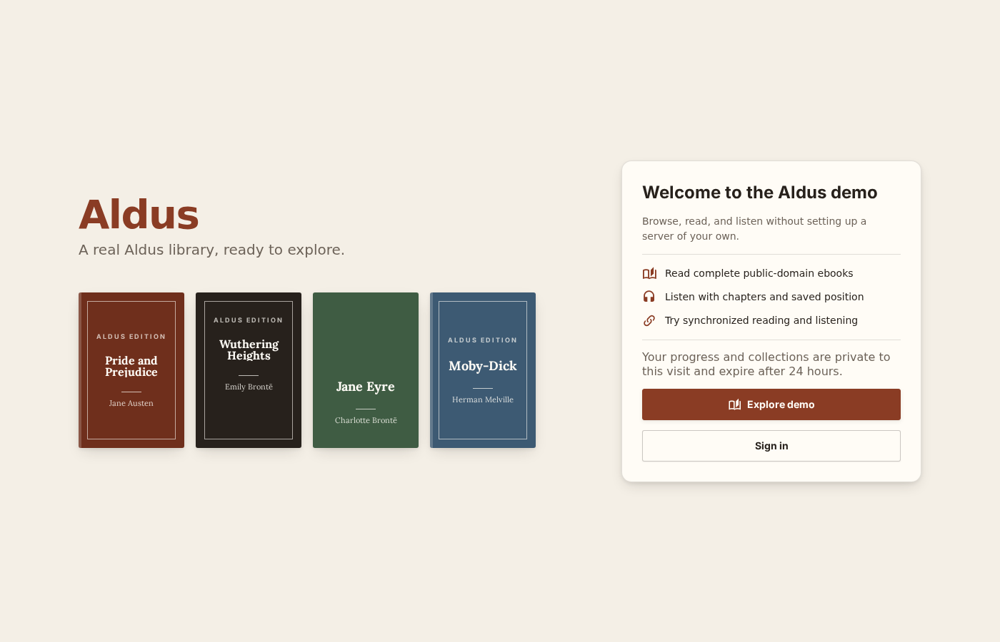

<div align="center">

<h1>
  
  Aldus
</h1>

**A self-hosted home for the books you own — ebooks and audiobooks, read together.**

[](https://github.com/mahcks/aldus/releases)
[](https://github.com/mahcks/aldus/pkgs/container/aldus)
[](LICENSE)

[Live demo](https://demo.aldus.media) · [Quickstart](#run-it-in-under-a-minute) · [Screenshots](#what-it-looks-like)

</div>

<br>

<p align="center">
  
</p>

<br>

Most people who own both an ebook and its audiobook edition live with two disconnected apps and no memory between them: close the book on your commute, lose your place when you pick up the audio that night. Aldus is a personal library server that finds your books, brings in the format you're missing, and keeps your exact position synchronized between reading and listening — down to the sentence, not just "roughly where you were."

It's built for the way a household actually keeps books. One person hosts it. Everyone else opens a title and reads or listens, without ever needing to know what a library, a source, or an indexer is. The person running it gets real controls — storage, download policy, permissions, backups. Everyone else gets a calm, book-shaped app that gets out of the way.

<br>

## Run it in under a minute

Every tagged release publishes a ready-to-run, multi-architecture image to GitHub Container Registry. **There is nothing to build.** `docker compose up -d` pulls `ghcr.io/mahcks/aldus` and starts serving — no Go toolchain, no Node, no local Dockerfile.

```sh
git clone https://github.com/mahcks/aldus.git
cd aldus
cp .env.example .env
docker compose up -d
```

Open [http://localhost:8080](http://localhost:8080) and create the first account — it becomes the administrator. Pin a specific release in `.env` before starting if you don't want `latest`:

```dotenv
ALDUS_VERSION=0.1.0-beta.13
```

Prefer to look before you clone anything? [demo.aldus.media](https://demo.aldus.media) runs the current build against a small public-domain catalog — no account required.

<br>

## What it looks like

<table>
<tr>
<td width="50%">

<p align="center"><sub>One title, two formats, one position kept in sync</sub></p>
</td>
<td width="50%">

<p align="center"><sub>Missing description and genre tags, filled in from Open Library</sub></p>
</td>
</tr>
<tr>
<td width="50%">

<p align="center"><sub>Browse and filter by what's actually available to read or listen to</sub></p>
</td>
<td width="50%">

<p align="center"><sub>Generated cover art with adjustable design, position, and color when no artwork exists</sub></p>
</td>
</tr>
</table>

<br>

## Read↔listen sync that means it

When a book's ebook and audiobook are aligned, switching from reading to listening resumes at the *same point in the text* — not an approximate percentage rounded to the nearest chapter. Alignment happens once, automatically, in the background; after that, the format you pick up doesn't matter.



<br>

## Ask for what's missing, without the busywork

Point Aldus at your indexers and download client once, and an ordinary reader never has to think about either again.



Indexer names, file sizes, and release strings never surface to someone who just wants to read. They see plain-language status in **Activity**: searching, downloading, importing, ready. If nothing suitable exists yet, the request stays open and Aldus keeps watching — it never dead-ends silently.

<br>

## Everything else Aldus does

| | |
| --- | --- |
| **A household, not just a user** | Libraries are access grants, not walls. Most setups need zero configuration; multi-library households — a shared collection plus a kids' library — get real isolation when they need it. |
| **Bring what you already have** | Point Aldus at a folder of EPUBs and audio files and it imports them without renaming or rewriting a single file. Nothing you already own gets touched. |
| **Two ways to store media** | External Sources stay exactly where they are, referenced read-only. Managed media from acquisitions is copied in, checksummed, and verified on import. |
| **Read anywhere** | Native apps for iOS and Android, a full web app, and OPDS + KOReader credentials for e-ink devices — all backed by the same server and the same progress. |
| **Verified backups** | `docker compose run --rm aldus backup` produces a checksummed archive of the database, managed media, covers, and alignment artifacts — credentials scrubbed automatically. |
| **It's yours** | Self-hosted, your data, on your hardware. No account required anywhere but your own server. |

<br>

<p align="center">
  
</p>
<p align="center"><sub>Full control over sources, members, and acquisition policy per library</sub></p>

<br>

## Choose how far you want to go

| I want to… | Set up… | Then explore… |
| --- | --- | --- |
| Browse books I already own | One Library and one Source | Home, Discover, and Collections |
| Read an EPUB | An imported EPUB | The title page, then **Read** |
| Listen to an audiobook | Imported MP3/M4B audio | The title page, then **Listen** |
| Test read/listen synchronization | Matching ebook and audiobook plus alignment | Switching formats without losing your place |
| Request missing formats | Prowlarr, qBittorrent, and library download rules | Discover and Activity |
| Use KOReader | A reader credential | Account → KOReader and OPDS |

Drop a few EPUB, MP3, M4B, or audiobook files into `library-media/`, then: open **More → Libraries** and create one, open **More → Sources** and add `/library/media`, start a scan, accept anything in **Import review**, and open a title from **Home** or **Discover**. You do not need Prowlarr or qBittorrent just to try the library and reader.

The Compose file mounts `./library-media` read-only. Aldus indexes those files but never renames, moves, or rewrites them.

<br>

## Set up automatic requests

This part is optional. Aldus currently works with [Prowlarr](https://prowlarr.com/) to search your configured indexers and [qBittorrent](https://www.qbittorrent.org/) to download a selected release. Usenet clients aren't supported yet.

Open **More → Acquisitions**, connect both services, and test each connection. Then, per library, set default destinations, maximum size, allowed formats, preferred language, and whether abridged audiobooks are acceptable. Finally choose what each member may do: request a missing format, skip approval for compliant requests, or use advanced release choice instead of Aldus's guided pick.

For acquisitions, qBittorrent and Aldus must see the same completed-download folder. Set `ALDUS_DOWNLOAD_PATH` to the host folder qBittorrent uses, then set **qBittorrent download root** in Aldus to qBittorrent's container path (commonly `/downloads`).

<br>

## Backups and upgrades

Take a verified, checksummed backup before experimenting:

```sh
docker compose run --rm aldus backup \
  --archive /backups/aldus-backup-$(date +%Y%m%d).tar.gz
```

Restore while Aldus is stopped and `/data` is empty:

```sh
docker compose stop aldus
docker compose run --rm aldus restore \
  --archive /backups/aldus-backup-20260819.tar.gz \
  --data-dir /data
docker compose up -d
```

To update, pin the new version in `.env`, then `docker compose pull && docker compose up -d`. Take a backup first; to roll back, restore the matching backup and set `ALDUS_VERSION` back to its previous value. Avoid `latest` for data you care about.

<br>

## Using Aldus away from your server

The web app works from any browser that can reach your Aldus server. Put it behind an HTTPS reverse proxy or a trusted private network for remote access, and set `ALDUS_SECURE_COOKIES=true` once HTTPS terminates in front of it. The native iOS and Android apps are currently development builds — store distribution isn't configured yet.

For e-ink devices, create a credential under **Account → KOReader and OPDS**, then add the displayed `/opds/` URL as an OPDS catalog and use the Aldus origin as KOReader's custom progress server.

<br>

## When something doesn't work

**Aldus can't see my books** — confirm the host folder is mounted, that the Source path is `/library/media` (not the host's original path), and that `ALDUS_SOURCE_ROOTS` includes the server-visible path.

**A request doesn't start** — test Prowlarr and qBittorrent under **More → Acquisitions**, confirm the library has default destinations for that format, and check whether the request is waiting on approval.

**A download finished but the title is unavailable** — confirm `ALDUS_DOWNLOAD_PATH` matches qBittorrent's folder, confirm **qBittorrent download root** is set correctly, and check **More → Sources → Import review** — Aldus asks for help when a completed payload is ambiguous or conflicts with an existing format.

**Is the server healthy?** `/api/health` confirms the process is running; `/api/ready` checks SQLite and data-directory write access.

<br>

## Developing Aldus

You need Go 1.26+, Bun 1.3.5+, Node.js LTS, `ffprobe`, and Docker for production-image work.

```sh
cd app && bun install && cd ..
make dev
```

| Command | Does |
| --- | --- |
| `make dev-server` | Go server on port 8080 |
| `make dev-app` | Expo development server |
| `make expo-dev` | Metro for an installed native development client |
| `make ios-dev` | Build and install the iOS development client |
| `make demo-media` | Fetch and verify the public-domain demo catalog |
| `make build` | Production web export and Go build |
| `make test` | Go, race, client, and TypeScript tests |
| `make lint` | Go vet, formatting, and Expo lint |
| `make generate` | Regenerate sqlc and public TypeScript contracts |
| `make docker` | Build the production container locally |

The repository stays small on purpose: `app/` is the universal Expo client, `server/` is the Go API and production web server, `tools/` is the optional alignment worker, `docs/` has contributor and architecture notes. The production image serves both the API and the exported web app from one binary.

<br>

## Where this is headed

The ambition is a complete, calm home for the books you own — one that treats reading and listening as one continuous act instead of two apps that happen to share a title. Acquisition, alignment, and the household permission model are the parts still hardening the fastest, so expect them to change shape a little before things settle. Aldus is public enough to use for real, not yet old enough to have found all its own edges — if you run into something that doesn't add up, that report is exactly what's useful right now.

<p align="center">
  
</p>
