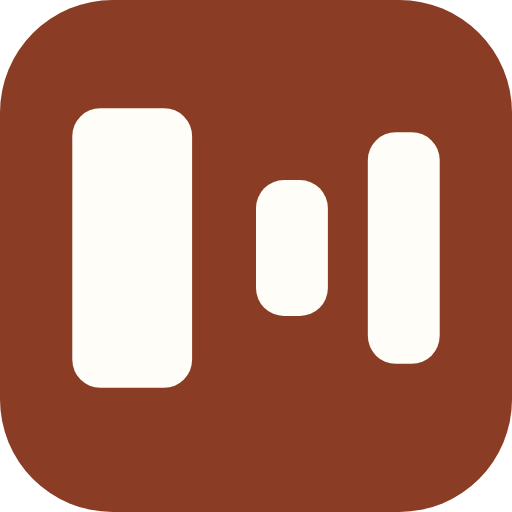
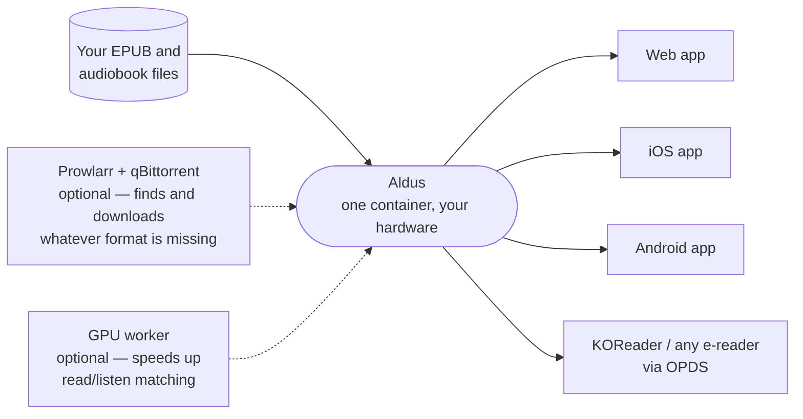
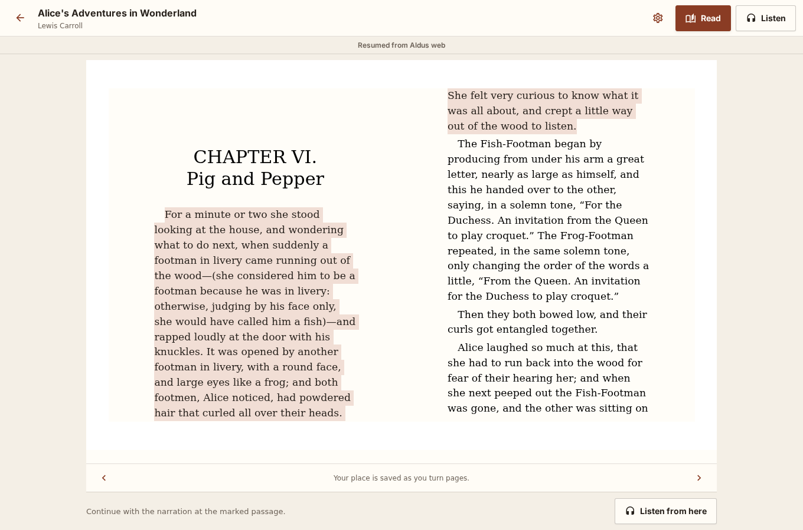
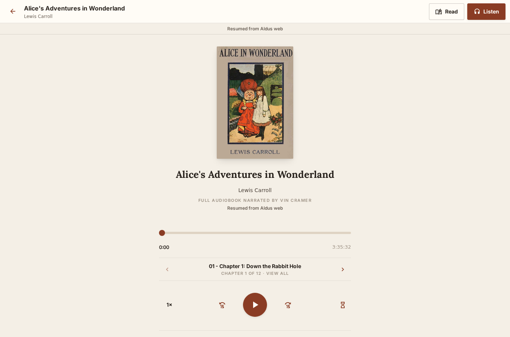
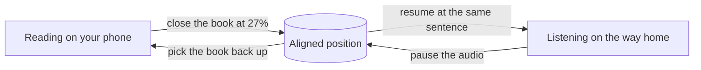
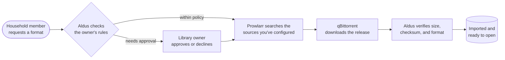
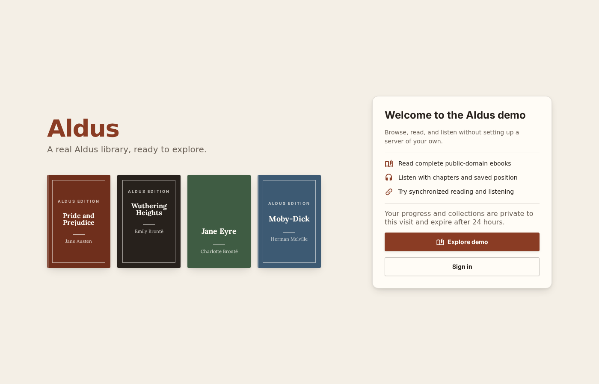

<div align="center">

<h1>
  
  Aldus
</h1>

**A self-hosted home for the books you own — ebooks and audiobooks, read together.**

[](#current-beta-status)
[](LICENSE)

[TestFlight beta](https://testflight.apple.com/join/FUfZvzkt) · [Live demo](https://demo.aldus.media) · [Documentation](https://aldus.media) · [Quickstart](#run-the-server)

</div>

Most people who own both an ebook and its audiobook live with two disconnected apps and no memory between them. Close the book on your commute, and you lose your place when you pick up the audio that night.

Aldus fixes that. It's a personal library server that finds your books, brings in the format you're missing, and keeps your exact position synchronized between reading and listening — down to the sentence, not just "roughly where you were."

It's built for the way a household actually keeps books. One person hosts it — that's the only part that takes any technical know-how. Everyone else just opens a title and reads or listens, without ever needing to know what a library, a source, or a search index is.

The host gets real controls: storage, download policy, permissions, backups. Everyone else gets a calm, book-shaped app that gets out of the way.

## How it fits together

Aldus is one small server you run yourself. Your book files never leave your machine; everything else here is optional.


```mermaid
flowchart LR
    F[(Your EPUB and<br/>audiobook files)] --> S([Aldus<br/>one container, your hardware])
    S --> W[Web app]
    S --> I[iOS app]
    S --> A[Android app]
    S --> K[KOReader / any e-reader<br/>via OPDS]
    P[Prowlarr + qBittorrent<br/>optional — finds and downloads<br/>whatever format is missing] -.-> S
    G[GPU worker<br/>optional — speeds up<br/>read/listen matching] -.-> S
```

The parts on solid lines are what a working library needs. The two dotted boxes are add-ons — nothing breaks if you skip them, and both are covered later in this README.

## Current beta status

Aldus is public beta software. The source, self-hosted server, web app, and public demo are available now; anyone with an iPhone or iPad can [join the public TestFlight beta](https://testflight.apple.com/join/FUfZvzkt). Android is implemented but does not yet have a public build. Expect rough edges, and take a verified backup before upgrading a server you depend on.

## Run the server

**What you need:** a computer, NAS, or Raspberry Pi (4 or newer) that can run [Docker](https://docs.docker.com/get-docker/), and about five minutes. If `docker` already works in your terminal, you have everything required.

There's nothing to download or build beyond that — every tagged release is a ready-to-run image. Copy this into a terminal on that machine:

```sh
# Make a folder for Aldus and its files
mkdir -p aldus/library-media aldus/downloads && cd aldus

# Grab this release's setup file
ALDUS_VERSION=0.1.0-beta.21
curl -fL "https://github.com/Mahcks/Aldus/releases/download/v${ALDUS_VERSION}/compose.yml" -o compose.yml
printf 'ALDUS_VERSION=%s\n' "$ALDUS_VERSION" > .env

# Start Aldus
docker compose up -d --pull always
```

Give it a minute to finish pulling the image, then open [http://localhost:8080](http://localhost:8080). You'll land on a setup screen — the first account you create becomes the administrator. **That's it — Aldus is running.**

Want to confirm it started cleanly before opening the browser? `docker compose ps` should list `aldus` as **healthy**.

> Planning to let anyone outside your own home use this? A couple of settings need to change first — see [Using Aldus away from your server](#using-aldus-away-from-your-server) before you share the link.

> **Current beta note:** `0.1.0-beta.21` matches your books to their audiobooks entirely on CPU by default, and also publishes an optional, faster NVIDIA image — see [Optional NVIDIA acceleration](#optional-nvidia-acceleration). Image downloads are large, so first startup time depends on your connection.

Prefer to look before installing anything? [demo.aldus.media](https://demo.aldus.media) runs the current build against a small public-domain catalog — no account required.

## What it looks like

<table>
<tr>
<td width="50%">

<p align="center"><sub>Read with adjustable typography, layout, and an exact synchronized passage</sub></p>
</td>
<td width="50%">

<p align="center"><sub>Listen with chapters, saved progress, and a live read-along passage</sub></p>
</td>
</tr>
</table>

## Reading and listening, as one continuous thing

The two formats of a book aren't just cross-linked. Aldus listens to the audiobook once and matches it, word for word, to the ebook text — we call that match an *alignment*.

Once it's built, switching from reading to listening resumes at the *same sentence*, not an approximate percentage rounded to the nearest chapter.


```mermaid
flowchart LR
    A[Reading on your phone] -->|close the book at 27%| B[(Aligned position)]
    B -->|resume at the same sentence| C[Listening on the way home]
    C -->|pause the audio| B
    B -->|pick the book back up| A
```

A few things fall out of that exact match:

- **Read-along.** While listening, Aldus can highlight the sentence being narrated in real time, sentence by sentence — turn it on or off from the player.
- **Continue on another device.** Open the same book on your phone while it's already open on the web, and Aldus asks which device should keep saving your place before either one writes over the other. The one you leave behind pauses cleanly instead of silently falling out of sync.
- **Light and dark, including the page itself.** Aldus follows your system's appearance, and the reader's own page follows along with it rather than staying a fixed white rectangle at night.

## Ask for what's missing, without the busywork

Point Aldus at a search tool and a download client once, and an ordinary reader never has to think about either again.


```mermaid
flowchart LR
    U([Household member<br/>requests a format]) --> R{Aldus checks<br/>the owner's rules}
    R -->|within policy| P[Prowlarr searches the<br/>sources you've configured]
    P --> Q[qBittorrent<br/>downloads the release]
    Q --> V[Aldus verifies size,<br/>checksum, and format]
    V --> L[(Imported and<br/>ready to open)]
    R -->|needs approval| O[Library owner<br/>approves or declines]
    O --> P
```

[Prowlarr](https://prowlarr.com/) is the search step — it already knows how to query the release sites you've configured, so Aldus never has to. [qBittorrent](https://www.qbittorrent.org/) is the download step.

Neither name, nor any file size or release string, ever surfaces to someone who just wants to read. They see plain-language status in **Activity**: searching, downloading, importing, ready. If nothing suitable exists yet, the request stays open and Aldus keeps watching — it never dead-ends silently.

## Everything else Aldus does

| | |
| --- | --- |
| **A household, not just a user** | Libraries are access grants, not walls. Most setups need zero configuration; multi-library households — a shared collection plus a kids' library — get real isolation when they need it. |
| **Bring what you already have** | Point Aldus at a folder of EPUBs and audio files and it imports them without renaming or rewriting a single file. Nothing you already own gets touched. |
| **Two ways to store media** | External sources stay exactly where they are, referenced read-only. Managed media brought in through a request is copied in, checksummed, and verified on import. |
| **Read anywhere** | Every server ships the web app. iOS is on the [public TestFlight beta](https://testflight.apple.com/join/FUfZvzkt); Android exists but has no public build yet. OPDS (a catalog format most e-readers can browse directly) plus KOReader credentials cover e-ink devices. |
| **Verified backups** | `docker compose run --rm aldus backup` produces a checksummed archive of the database, managed media, covers, and alignment artifacts. The stored Prowlarr API key, qBittorrent password, and active sessions are removed from the archive. |
| **It's yours** | Self-hosted, your data, on your hardware. No account required anywhere but your own server. |

## Choose how far you want to go

| I want to… | Set up… | Then explore… |
| --- | --- | --- |
| Browse books I already own | One library and one source | Home, Discover, and Collections |
| Read an EPUB | An imported EPUB | The title page, then **Read** |
| Listen to an audiobook | Imported MP3/M4B audio | The title page, then **Listen** |
| Try read/listen synchronization | A matching ebook and audiobook | Switching formats without losing your place |
| Pick up on another device | The same account on two devices | Opening a book that's already open elsewhere |
| Request missing formats | Prowlarr, qBittorrent, and library download rules | Discover and Activity |
| Use KOReader | A reader credential | Account → KOReader and OPDS |

Drop a few EPUB, MP3, M4B, or audiobook files into `library-media/`, then:

1. Open **More → Libraries** and create one.
2. Open **More → Sources**, add `/library/media`, and start a scan.
3. Accept anything that needs a look in **Import review**.
4. Open a title from **Home** or **Discover**.

You do not need Prowlarr or qBittorrent just to try the library and reader. The Compose file mounts `./library-media` read-only — Aldus indexes those files but never renames, moves, or rewrites them.

## Set up automatic requests

This part is entirely optional, and works with [Prowlarr](https://prowlarr.com/) and [qBittorrent](https://www.qbittorrent.org/). Usenet clients aren't supported yet.

1. Open **More → Acquisitions**, connect both services, and test each connection.
2. Per library, set default destinations, maximum size, allowed formats, preferred language, and whether abridged audiobooks are acceptable.
3. Choose what each member may do: request a missing format, skip approval for compliant requests, or use advanced release choice instead of Aldus's guided pick.

Readers request new titles from **Discover**, or use **Get another format** on a book they already own. Aldus names the destination when only one library is eligible and asks for a choice when several are available. Requesting the same active format again reuses the request instead of consuming another quota slot.

**Activity → Requests** separates active, ready, and past requests before pagination, so older pending requests stay reachable. **View request** follows one request through approval, import, and opening the newly available format. Administrators review requests under **Acquisitions**.

One thing has to match on both sides: qBittorrent and Aldus need to agree on where a finished download actually lives. Set `ALDUS_DOWNLOAD_PATH` to the host folder qBittorrent uses, then set **qBittorrent download root** in Aldus to qBittorrent's own path for that same folder (commonly `/downloads`).

## Backups and upgrades

Create and download a verified backup from **More → System → Data and recovery**. The command line remains available for emergency recovery:

```sh
docker compose run --rm aldus backup \
  --archive /backups/aldus-backup-$(date +%Y%m%d).tar.gz
```

Restore while Aldus is stopped and `/data` is empty:

```sh
docker compose stop aldus
docker compose run --rm aldus restore \
  --archive /backups/aldus-backup-20260819.tar.gz \
  --data-dir /data
docker compose up -d
```

To update: take a backup, download the new release's `compose.yml`, change `ALDUS_VERSION` in `.env`, then run `docker compose pull && docker compose up -d`. That keeps the image and its deployment file on the same release.

To roll back, restore the matching backup using both the previous image version and the previous Compose file. Aldus intentionally has no implicit `latest` tag to fall back on.

## Using Aldus away from your server

The default setup only answers on `localhost` — nobody outside your own machine can reach it yet. Before that changes:

1. Create the first administrator account locally, before exposing anything.
2. Put Aldus behind an HTTPS reverse proxy — something like Caddy, nginx, or Traefik that handles the encryption for you and forwards plain traffic to Aldus.
3. Set `ALDUS_BIND_HOST=0.0.0.0` and `ALDUS_SECURE_COOKIES=true` once that proxy is genuinely what people connect to.

A trusted-LAN-only mode without a proxy exists for native clients on private IPs, but it requires the explicit `ALDUS_ALLOW_INSECURE_HTTP=true` acknowledgement. Never use that mode on a server reachable from the internet.

## Optional NVIDIA acceleration

The standard Aldus image includes WhisperX and builds every book's exact read/listen alignment on CPU automatically — no extra setup. CPU processing can take hours for a long audiobook.

To speed it up, install the NVIDIA driver and the [NVIDIA Container Toolkit](https://docs.nvidia.com/datacenter/cloud-native/container-toolkit/latest/install-guide.html), then run one command:

```sh
curl -fL https://github.com/Mahcks/Aldus/releases/download/v0.1.0-beta.21/compose.gpu.yml -o compose.gpu.yml
docker compose -f compose.yml -f compose.gpu.yml up -d --pull always
```

The override replaces the same `aldus` container and requests one GPU. Aldus picks CUDA, FP16, and a conservative memory profile on its own. If CUDA isn't available, the alignment job reports a useful error while the rest of Aldus keeps working normally. Return to CPU processing with `docker compose up -d --pull always`.

For e-ink devices, create a credential under **Account → KOReader and OPDS**. Add the displayed `/opds/` URL as an OPDS catalog, and use the Aldus origin as KOReader's custom progress server. Keep KOReader's document matching method set to **Binary** — Aldus preserves native progress for every recognized EPUB and bridges it to read↔listen progress whenever an exact alignment is ready.

## When something doesn't work

**Aldus can't see my books** — confirm the host folder is mounted, that the Source path is `/library/media` (not the host's original path), and that `ALDUS_SOURCE_ROOTS` includes the server-visible path.

**A request doesn't start** — test Prowlarr and qBittorrent under **More → Acquisitions**, confirm the library has default destinations for that format, and check whether the request is waiting on approval.

**A download finished but the title is unavailable** — confirm `ALDUS_DOWNLOAD_PATH` matches qBittorrent's folder, confirm **qBittorrent download root** is set correctly, and check **More → Sources → Import review**; Aldus asks for help when a completed payload is ambiguous or conflicts with an existing format.

**Switching devices didn't do what I expected** — this is one of the newest, least-hardened parts of Aldus (see below). If a device seems stuck saying it isn't saving your place, reopen the book on that device to re-ask who currently owns it.

**Is the server healthy?** `/api/v1/health` confirms the process is running; `/api/v1/ready` checks SQLite and data-directory write access.

## Where this is headed

The ambition is a complete, calm home for the books you own — one that treats reading and listening as one continuous act instead of two apps that happen to share a title.

Acquisition, alignment, cross-device continuity, and the household permission model are the parts still hardening the fastest, so expect them to change shape a little before things settle. Aldus is in beta and ready for focused real-world testing, but it is not yet a stable 1.0 release. If something doesn't add up, that report is exactly what's useful right now.

<p align="center">
  
</p>

Want to help build Aldus? Start with [CONTRIBUTING.md](CONTRIBUTING.md).
